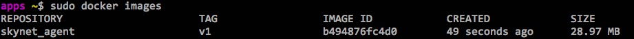

mafio
===========

This is a daemon server for various job in mafio ecosystem

```
$ go run main.go

                _____.__        
  _____ _____ _/ ____\__| ____  
 /     \\__  \\   __\|  |/  _ \ 
|  Y Y  \/ __ \|  |  |  (  <_> )
|__|_|  (____  /__|  |__|\____/ 
      \/     \/     

		   Verson 0.2.1

```

## 运行环境

Go Version >= 1.7

本框架使用`godep`进行版本管理，如在开发过程中引入新的依赖包，请进行命令
```
$ godep save
```

相关依赖包已集成到 `vendor` 目录中

## Quick Start

#### 1. 命令方式启动

```
go run main.go -input=file -output=logr
```

#### 2. 配置文件方式

```
go run main.go -config=/your/config/file/path
```

## 参数列表

```
  -agent-id string
        agent的编号 (default "sky01")
  -agent-group string
        agent的所在组 (default "net01")
  -config string
        配置文件路径
  -etcd-endpoint string
        ectd 服务发现地址 (default "0.0.0.0:2379")
  -filepath string
        监控文件路径(用于input插件为file的情况)
  -http-address string
        <addr>:<port> to listen on for HTTP clients (default "0.0.0.0:10630")
  -influxdb-addr string
        influxDB 地址, 用于性能监控
  -max-read-channel-size int
        最大读入通道大小 (default 4096)
  -max-write-bulk-size int
        最大每批输出数 (default 500)
  -max-write-channel-size int
        最大输出通道大小 (default 4096)
  -input string
        input 插件名称 (default "stdin")
 -filter string
        filter 插件名称 (default "valid")
  -output string
        output 插件名称 (default "stdout")
  -f  string
        配置json字符串
  -version
        输出版本信息
```

## 特性

一. 高并发
    
数据采集和数据发送均采用channel机制, 背后依靠Go语言高并发的特定进行任务调度。

二. 可监控

- 采用api的方式监控 

    - 版本信息: 
    ```
    http://127.0.0.1:10630/version
    ```

    - 堆信息
    ```
    http://127.0.0.1:10630/debug?cmd=heap
    ```

    - 垃圾回收信息
    ```
    http://127.0.0.1:10630/debug?cmd=gc
    ```

    - goroutinue信息
    ```
    http://127.0.0.1:10630/debug?cmd=go
    ```

- 采用metrics的方式

    通过参数 -influxdb-addr 设置influxdb后，agent(mafio)能自动把性能采集的信息发送到influxdb，十分方便！如下图：

    

    注意：influxDB的数据库名默认为agent(mafio)的group名。

三. 插件化

支持 input、output、fliter插件，符合个性化的开发需求

为了插件的平滑切换，建议插件命名以 name:tag 的规范，举个例子：

(可选)  
我们写了一个文件读入的input插件, 假如命名为 filereader:V1, 随着业务深入，我们可能需要对原有插件提供额外功能，于是我们可以再写一个input模块，命名为 filereader:V2。这样我们在启动agent(mafio)的时候，如果V2版本出现问题的时候，我们可以立刻通过 -input=filereader:V1进行 “降级”。这样提高了可读性可理解性。

四. 容器化

支持通过附带的Dockerfile以容器的方式运行本agent(mafio)

```
sudo docker build -t mafio:v1 .
```

采用Alpine，构建出来的镜像大小只有 29M ，非常轻量级。 这样我们能再节点上运行我们的轻量级容器



## TODO

1.cron调度支持

2.多output支持

3.服务发现